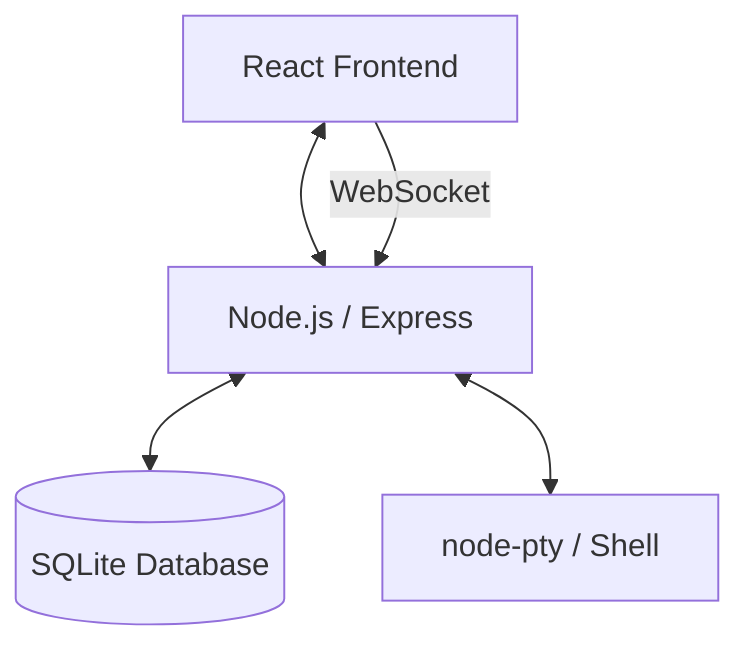

# ⚡ Ryo Terminal

A premium, high-performance web-based terminal emulator with real shell execution, persistent sessions, and a modular architecture.


## 🌟 Key Features

- **Real Shell Interaction**: Direct execution on the host system or via SSH.
- **Extension System**: Modular sidebar plugins (File Explorer, Dashboard, Theme Builder, etc.).
- **Persistence**: SQLite-backed user settings, macros, and command history.
- **Tmux Integration**: Persistent shell sessions that survive disconnects.
- **Glassmorphic UI**: High-fidelity modern interface with CRT effects and micro-animations.
- **Reconnection**: Robust WebSocket handler with exponential backoff.

## 🏗 Architecture



## 🚀 Quick Start (Docker)

The easiest way to run Ryo Terminal is via Docker Compose:

```bash
docker-compose up -d
```

Access the UI at `http://localhost:5173`. Default credentials: `admin / admin123`.

## 🛠 Manual Installation

### Prerequisites
- Node.js (v20+)
- build-essential (make, g++)

### 1. Backend Setup
```bash
cd server
npm install
npm run build
npm start
```

### 2. Frontend Setup
```bash
cd client
npm install
npm run build
npm run preview
```

## 📜 API Documentation
See [API.md](./API.md) for full endpoint and protocol specifications.

---
© 2026 Ryo Team. Built with passion for power users.
